<div align="center">
  
  
  
  # 🚀 SMG Employee Cloud Portal
  
  ### **Enterprise-Grade Multi-Portal Management System**
  
  [](https://reactjs.org/)
  [](https://www.typescriptlang.org/)
  [](https://vitejs.dev/)
  [](https://tailwindcss.com/)
  
  [](LICENSE)
  [](http://makeapullrequest.com)
  [](https://github.com/abhishekk-y/SMG-Employee-Cloud-Portal/graphs/commit-activity)

  ---
  
  **A comprehensive, role-based enterprise management platform designed for SMG Scooters Pvt. Ltd.**  
  Unified login • 13+ Department Portals • Real-time Analytics • Premium UI/UX
  
  [Features](#-key-features) • [Quick Start](#-quick-start) • [Documentation](#-project-structure) • [Demo](#-default-login-credentials)

</div>

---

## 📋 Overview

**SMG Employee Cloud Portal** is a modern, scalable enterprise management system that provides a unified authentication experience with dedicated portals for different organizational roles. Built with cutting-edge technologies and designed for optimal performance.

### ✨ Key Features

<table>
  <tr>
    <td width="33%" align="center">
      <h4>🔐 Unified Authentication</h4>
      <p>Single login with role-based access control and session management</p>
    </td>
    <td width="33%" align="center">
      <h4>👥 Multi-Portal Architecture</h4>
      <p>Employee, Admin, Super Admin, and 13 specialized department portals</p>
    </td>
    <td width="33%" align="center">
      <h4>🎨 Premium UI/UX</h4>
      <p>Modern, animated interface with SMG blue theme and Framer Motion</p>
    </td>
  </tr>
  <tr>
    <td width="33%" align="center">
      <h4>📊 Real-time Analytics</h4>
      <p>Live dashboards with charts, statistics, and performance metrics</p>
    </td>
    <td width="33%" align="center">
      <h4>⚡ Lightning Fast</h4>
      <p>Powered by Vite for instant HMR and optimized production builds</p>
    </td>
    <td width="33%" align="center">
      <h4>📱 Fully Responsive</h4>
      <p>Seamless experience across desktop, tablet, and mobile devices</p>
    </td>
  </tr>
</table>

---

## 🏗️ System Architecture



```mermaid
graph TD
    A[SMG Unified Portal] --> B[Employee Portal]
    A --> C[Admin Portal]
    A --> D[Super Admin Portal]
    A --> E[Department Portals]
    
    B --> B1[Dashboard]
    B --> B2[Profile Management]
    B --> B3[Leave Requests]
    B --> B4[Attendance Tracking]
    
    C --> C1[Employee Management]
    C --> C2[Department Oversight]
    C --> C3[Reports & Analytics]
    C --> C4[System Configuration]
    
    D --> D1[Global System Control]
    D --> D2[User Role Management]
    D --> D3[Security Settings]
    D --> D4[Audit Logs]
    
    E --> E1[Reception]
    E --> E2[HR]
    E --> E3[Finance]
    E --> E4[Time Office]
    E --> E5[Canteen]
    E --> E6[Events]
    E --> E7[Technician]
    E --> E8[Assembly]
    E --> E9[Marketing]
    E --> E10[Transport]
    E --> E11[SIM Allocation]
    E --> E12[Uniform]
    E --> E13[Guest House]
```

### 📦 Department Portals

| Department | Features | Key Functionality |
|------------|----------|-------------------|
| **Reception** | Visitor Management, Desk Operations | Check-ins, Visitor logs, Access control |
| **HR** | Employee Records, Recruitment | Hiring, Onboarding, Performance tracking |
| **Finance** | Accounting, Payroll | Expense tracking, Salary processing |
| **Time Office** | Attendance Tracking | Time logs, Leave management, Shifts |
| **Canteen** | Meal Management | Coupon issuance, Menu planning |
| **Events** | Event Planning | Bookings, Schedules, Coordination |
| **Technician** | Maintenance Requests | Work orders, Equipment tracking |
| **Assembly** | Production Tracking | Assembly line management |
| **Marketing** | Campaign Management | Marketing initiatives, Analytics |
| **Transport** | Fleet Management | Vehicle tracking, Trip requests |
| **SIM Allocation** | SIM Card Management | Issuance, Tracking, Billing |
| **Uniform** | Uniform Distribution | Inventory, Issuance tracking |
| **Guest House** | Accommodation | Room bookings, Guest management |

---

## 🚀 Quick Start

### Prerequisites

Before you begin, ensure you have the following installed:

-  **Node.js** >= 18.0.0
-  **npm** >= 9.0.0 or **yarn** >= 1.22.0

### 🔧 Installation

```bash
# 1️⃣ Clone the repository
git clone https://github.com/abhishekk-y/SMG-Employee-Cloud-Portal.git
cd SMG-Employee-Cloud-Portal

# 2️⃣ Install dependencies
npm install

# 3️⃣ Start development server
npm run dev

# 4️⃣ Open your browser
# Navigate to http://localhost:5173
```

### 🎯 Quick Commands

| Command | Description |
|---------|-------------|
| `npm run dev` | Start development server with HMR |
| `npm run build` | Build for production |
| `npm run preview` | Preview production build locally |
| `npm run lint` | Run ESLint code quality checks |

---

## 🎨 Tech Stack

<div align="center">

| Technology | Purpose | Version | Logo |
|-----------|---------|---------|------|
|  **React** | UI Framework | 18.3.1 | Core library for building user interfaces |
|  **TypeScript** | Type Safety | 5.6.2 | Static typing for enhanced code quality |
|  **Vite** | Build Tool | 6.0.5 | Lightning-fast dev server and bundler |
|  **Tailwind CSS** | Styling | 3.4.17 | Utility-first CSS framework |
|  **Framer Motion** | Animations | 11.15.0 | Production-ready motion library |
|  **Radix UI** | Components | Latest | Accessible component primitives |
|  **Lucide React** | Icons | 0.468.0 | Beautiful, consistent icon set |
|  **React Router** | Routing | 7.1.1 | Declarative routing for React apps |

</div>

---

## 📁 Project Structure

```
SMG-Employee-Cloud-Portal/
├── 📂 public/
│   └── Company Logo.jpg          # SMG company branding
│
├── 📂 src/
│   ├── 📂 components/
│   │   ├── Login.tsx             # Unified login component
│   │   ├── Sidebar.tsx           # Navigation sidebar
│   │   └── 📂 ui/                # Reusable UI components (shadcn/ui)
│   │       ├── button.tsx
│   │       ├── card.tsx
│   │       ├── dialog.tsx
│   │       └── ...
│   │
│   ├── 📂 pages/
│   │   ├── EmployeeDashboard.tsx
│   │   ├── AdminDashboard.tsx
│   │   ├── SuperAdminDashboard.tsx
│   │   ├── DepartmentPortalHub.tsx
│   │   └── 📂 departments/       # Individual department portals
│   │       ├── ReceptionPortal.tsx
│   │       ├── HRPortal.tsx
│   │       ├── FinancePortal.tsx
│   │       ├── TimeOfficePortal.tsx
│   │       ├── CanteenPortal.tsx
│   │       ├── EventsPortal.tsx
│   │       ├── TechnicianPortal.tsx
│   │       ├── AssemblyPortal.tsx
│   │       ├── MarketingPortal.tsx
│   │       ├── TransportPortal.tsx
│   │       ├── SimPortal.tsx
│   │       ├── UniformPortal.tsx
│   │       └── GuesthousePortal.tsx
│   │
│   ├── 📂 portals/
│   │   ├── 📂 hr/               # HR portal components
│   │   ├── 📂 finance/          # Finance portal components
│   │   └── Layout.jsx           # Common layout wrapper
│   │
│   ├── 📂 utils/
│   │   ├── helpers.ts           # Utility functions
│   │   └── pdfExport.ts         # PDF generation utilities
│   │
│   ├── App.tsx                  # Main app component with routing
│   ├── main.tsx                 # Application entry point
│   └── index.css                # Global styles & Tailwind imports
│
├── 📄 .env.example              # Environment variables template
├── 📄 package.json              # Project dependencies
├── 📄 tsconfig.json             # TypeScript configuration
├── 📄 vite.config.ts            # Vite configuration
├── 📄 tailwind.config.js        # Tailwind CSS configuration
├── 📄 LICENSE                   # MIT License
└── 📄 README.md                 # You are here! 📍
```

---

## 🔐 Security Features

<table>
  <tr>
    <td width="50%">
      <h4>✅ Role-Based Access Control (RBAC)</h4>
      <p>Fine-grained permissions based on user roles</p>
    </td>
    <td width="50%">
      <h4>✅ Protected Routes</h4>
      <p>Route guards preventing unauthorized access</p>
    </td>
  </tr>
  <tr>
    <td width="50%">
      <h4>✅ Session Management</h4>
      <p>Secure token-based authentication</p>
    </td>
    <td width="50%">
      <h4>✅ Input Validation</h4>
      <p>Client-side and server-side validation</p>
    </td>
  </tr>
  <tr>
    <td width="50%">
      <h4>✅ XSS Protection</h4>
      <p>Cross-site scripting prevention</p>
    </td>
    <td width="50%">
      <h4>✅ CSRF Protection</h4>
      <p>Anti-forgery token support (backend required)</p>
    </td>
  </tr>
</table>

---

## 👥 Default Login Credentials

### 🧪 For Testing Purposes

<table>
  <thead>
    <tr>
      <th width="25%">Role</th>
      <th width="35%">Email</th>
      <th width="20%">Password</th>
      <th width="20%">Access Level</th>
    </tr>
  </thead>
  <tbody>
    <tr>
      <td><strong>👤 Employee</strong></td>
      <td><code>employee@smg</code></td>
      <td><code>employee</code></td>
      <td><span style="color: #10B981;">Basic</span></td>
    </tr>
    <tr>
      <td><strong>👨‍💼 Admin</strong></td>
      <td><code>admin@smg</code></td>
      <td><code>admin</code></td>
      <td><span style="color: #F59E0B;">Advanced</span></td>
    </tr>
    <tr>
      <td><strong>⚡ Super Admin</strong></td>
      <td><code>superadmin@smg</code></td>
      <td><code>superadmin</code></td>
      <td><span style="color: #EF4444;">Full Control</span></td>
    </tr>
    <tr>
      <td><strong>🏢 Department</strong></td>
      <td><code>{department}@smg</code></td>
      <td><code>{department}</code></td>
      <td><span style="color: #3B82F6;">Department Specific</span></td>
    </tr>
  </tbody>
</table>

#### 📍 Department-Specific Logins

```
✓ Reception    : reception@smg    / reception
✓ HR           : hr@smg           / hr
✓ Finance      : finance@smg      / finance
✓ Time Office  : timeoffice@smg   / timeoffice
✓ Canteen      : canteen@smg      / canteen
✓ Events       : events@smg       / events
✓ Technician   : technician@smg   / technician
✓ Assembly     : assembly@smg     / assembly
✓ Marketing    : marketing@smg    / marketing
✓ Transport    : transport@smg    / transport
✓ SIM          : sim@smg          / sim
✓ Uniform      : uniform@smg      / uniform
✓ Guest House  : guesthouse@smg   / guesthouse
```

> ⚠️ **Important**: Change these credentials before deploying to production!

---

## 📦 Build & Deployment

### Production Build

```bash
# Create optimized production build
npm run build

# Output will be in dist/ folder
ls dist/
```

### 🌐 Deployment Options

<table>
  <tr>
    <td width="33%" align="center">
      <h4>▲ Vercel</h4>
      <p><em>(Recommended)</em></p>
      <pre>npm i -g vercel
vercel</pre>
    </td>
    <td width="33%" align="center">
      <h4>◆ Netlify</h4>
      <p><em>(Easy Setup)</em></p>
      <pre>npm i -g netlify-cli
netlify deploy --prod</pre>
    </td>
    <td width="33%" align="center">
      <h4>🐳 Docker</h4>
      <p><em>(Containerized)</em></p>
      <pre>docker build -t smg-portal .
docker run -p 3000:3000 smg-portal</pre>
    </td>
  </tr>
</table>

### Docker Configuration

```dockerfile
FROM node:18-alpine
WORKDIR /app
COPY package*.json ./
RUN npm install
COPY . .
RUN npm run build
EXPOSE 3000
CMD ["npm", "run", "preview"]
```

---

## ⚙️ Configuration

### Environment Variables

Create a `.env` file in the root directory:

```env
# API Configuration
VITE_API_URL=http://localhost:5000/api
VITE_API_TIMEOUT=30000

# Authentication
VITE_AUTH_TOKEN_KEY=smg_auth_token
VITE_SESSION_TIMEOUT=3600000

# Feature Flags
VITE_ENABLE_ANALYTICS=true
VITE_ENABLE_NOTIFICATIONS=true
VITE_ENABLE_DARK_MODE=false
```

---

## 🎯 Key Features Breakdown

### 🔄 Real-time Updates
- Live attendance tracking
- Instant notifications
- WebSocket support ready

### 📊 Analytics Dashboards
- Department-wise performance metrics
- Employee productivity charts
- Financial insights and trends

### 🎨 Modern UI Components
- Animated transitions with Framer Motion
- Accessible components from Radix UI
- Custom SMG blue theme throughout

### 📱 Responsive Design
- Mobile-first approach
- Tablet optimized layouts
- Desktop-enhanced experience

---

## 🤝 Contributing

We welcome contributions! Here's how you can help:

1. **Fork** the repository
2. **Create** a feature branch
   ```bash
   git checkout -b feature/AmazingFeature
   ```
3. **Commit** your changes
   ```bash
   git commit -m 'Add some AmazingFeature'
   ```
4. **Push** to the branch
   ```bash
   git push origin feature/AmazingFeature
   ```
5. **Open** a Pull Request

### 📋 Contribution Guidelines

- Follow the existing code style
- Write meaningful commit messages
- Add tests for new features
- Update documentation as needed
- Ensure all tests pass before submitting PR

---

## 📝 License

This project is licensed under the **MIT License** - see the [LICENSE](LICENSE) file for details.

```
MIT License

Copyright (c) 2025 SMG Scooters Pvt. Ltd.

Permission is hereby granted, free of charge, to any person obtaining a copy
of this software and associated documentation files (the "Software")...
```

---

## 📞 Support & Contact

<div align="center">

| Channel | Link |
|---------|------|
| 📧 **Email** | [support@smgscooters.com](mailto:support@smgscooters.com) |
| 🌐 **Website** | [smgscooters.com](https://smgscooters.com) |
| 📚 **Documentation** | [GitHub Wiki](https://github.com/abhishekk-y/SMG-Employee-Cloud-Portal/wiki) |
| 🐛 **Bug Reports** | [Issues](https://github.com/abhishekk-y/SMG-Employee-Cloud-Portal/issues) |
| 💬 **Discussions** | [GitHub Discussions](https://github.com/abhishekk-y/SMG-Employee-Cloud-Portal/discussions) |

</div>

---

## 🙏 Acknowledgments

<table>
  <tr>
    <td align="center" width="33%">
      <h4>SMG Scooters Pvt. Ltd.</h4>
      <p>For the opportunity and trust</p>
    </td>
    <td align="center" width="33%">
      <h4>Open Source Community</h4>
      <p>React, Vite, and amazing tools</p>
    </td>
    <td align="center" width="33%">
      <h4>Contributors</h4>
      <p>Everyone who helped build this</p>
    </td>
  </tr>
</table>

---

## 📊 Project Stats


---

<div align="center">

### 🌟 If this project helped you, please consider giving it a ⭐️!

---

**Made with ❤️ by the SMG Development Team**

**SMG Scooters Pvt. Ltd.** © 2025

[](https://github.com/abhishekk-y)

</div>